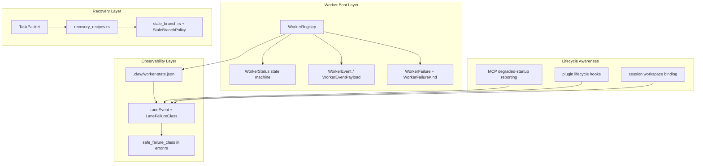

# Clawable Harness Principles

## What "Clawable" Means

A *clawable* coding harness is one designed for autonomous, scripted operation — not human-in-the-loop terminal interaction. The term is introduced in `references/claw-code/ROADMAP.md`:

> A clawable harness is:
> - deterministic to start
> - machine-readable in state and failure modes
> - recoverable without a human watching the terminal
> - branch/test/worktree aware
> - plugin/MCP lifecycle aware
> - event-first, not log-first
> - capable of autonomous next-step execution

The seven properties above are not independent features — they form a layered contract. Each property constrains how the others are implemented, and together they define the surface that a claw (an autonomous agent wired through hooks, plugins, sessions, and channel events) can reliably drive without manual intervention.

---

## Architecture



---

## 1. Deterministic to Start

**Principle:** A claw should be able to spawn a worker and receive a handle to it with no ambiguous states between "spawned" and "ready for prompt."

**Implementation:** `WorkerRegistry::create` in `rust/crates/runtime/src/worker_boot.rs` generates worker IDs from a monotonic counter + Unix timestamp. A worker begins in `WorkerStatus::Spawning` and immediately emits a `WorkerEvent::Spawning` event with a sequenced number.

**Evidence:**
- `WorkerRegistry::create` in `rust/crates/runtime/src/worker_boot.rs` (lines ~130–170) — worker creation with timestamp-based ID, no external state consulted
- `WorkerRegistry::await_ready` returns a `WorkerReadySnapshot` with `ready: bool` and `blocked: bool` — a claw can poll without parsing unstructured text

```rust
// rust/crates/runtime/src/worker_boot.rs
pub fn create(
    &self,
    cwd: &str,
    trusted_roots: &[String],
    auto_recover_prompt_misdelivery: bool,
) -> Worker {
    let ts = now_secs();
    let worker_id = format!("worker_{:08x}_{}", ts, inner.counter);
    let trust_auto_resolve = trusted_roots
        .iter()
        .any(|root| path_matches_allowlist(cwd, root));
    // Worker starts in Spawning, events list pre-populated
}
```

**Builder lesson:** Deterministic startup requires a monotonically increasing identity space and an unambiguous initial state. Any startup state that requires scanning external resources (filesystem, environment, network) before becoming "ready" is a clawability anti-pattern.

---

## 2. Machine-Readable State and Failure Modes

**Principle:** Every meaningful state and every failure must be representable as a structured value, not as prose to be parsed by a claw.

### Worker Status State Machine

`WorkerStatus` in `rust/crates/runtime/src/worker_boot.rs` defines an explicit enum with 6 states:

```rust
pub enum WorkerStatus {
    Spawning,
    TrustRequired,
    ReadyForPrompt,
    Running,
    Finished,
    Failed,
}
```

Transitions are gated — for example, `send_prompt` rejects workers that are not in `ReadyForPrompt` state, preventing a claw from accidentally delivering a prompt to a trust gate or a dead worker.

### Failure Classification

`WorkerFailureKind` in `rust/crates/runtime/src/worker_boot.rs` classifies boot failures:

```rust
pub enum WorkerFailureKind {
    TrustGate,
    PromptDelivery,
    Protocol,
    Provider,
}
```

`ApiError::safe_failure_class()` in `rust/crates/api/src/error.rs` classifies API-layer errors into 8 user-safe classes: `provider_auth`, `provider_internal`, `provider_retry_exhausted`, `provider_rate_limit`, `provider_transport`, `provider_error`, `context_window`, `runtime_io`.

### Lane Event Failure Taxonomy

`LaneFailureClass` in `rust/crates/runtime/src/lane_events.rs` normalizes runtime failures for the clawhip event pipeline:

```rust
pub enum LaneFailureClass {
    PromptDelivery,
    TrustGate,
    BranchDivergence,
    Compile,
    Test,
    PluginStartup,
    McpStartup,
    McpHandshake,
    GatewayRouting,
    ToolRuntime,
    WorkspaceMismatch,
    Infra,
}
```

**Evidence:**
- `WorkerStatus` enum in `rust/crates/runtime/src/worker_boot.rs`
- `WorkerFailureKind` enum in same file
- `LaneFailureClass` in `rust/crates/runtime/src/lane_events.rs`
- `ApiError::safe_failure_class` in `rust/crates/api/src/error.rs`

**Builder lesson:** Failure classification must be a closed set. Open-text failure messages ("something went wrong") require claw-side parsing and will silently break when new failure strings appear. Every new failure mode in the runtime should require a new variant in the failure enum, not a new string.

---

## 3. Recoverable Without Human Watching

**Principle:** For each known failure mode, there exists a structured recovery path that a claw can execute autonomously, without user confirmation, for a bounded number of attempts.

### Prompt Misdelivery Detection and Replay

`WorkerRegistry::observe` in `rust/crates/runtime/src/worker_boot.rs` detects when a prompt has landed in the shell or in the wrong target by comparing screen text against the expected prompt and the worker's CWD. When misdelivery is detected and `auto_recover_prompt_misdelivery` is enabled, the worker transitions to `ReadyForPrompt` with `replay_prompt` armed.

**Evidence:** `detect_prompt_misdelivery` function in `rust/crates/runtime/src/worker_boot.rs` (lines ~330–400) — inspects `screen_text`, `lowered`, `prompt`, `expected_cwd`, and `expected_receipt` to classify `WorkerPromptTarget::Shell | WrongTarget | WrongTask | Unknown`.

```rust
// rust/crates/runtime/src/worker_boot.rs
if worker.auto_recover_prompt_misdelivery {
    worker.replay_prompt = worker.last_prompt.clone();
    worker.status = WorkerStatus::ReadyForPrompt;
    push_event(worker, WorkerEventKind::PromptReplayArmed, ...);
} else {
    worker.status = WorkerStatus::Failed;
}
```

### Stale Branch Detection and Policy

`stale_branch.rs` in `rust/crates/runtime/src/` implements `check_freshness` (using `git rev-list --count`) to detect branches that are behind or have diverged from `main`. `StaleBranchPolicy` controls the response:

```rust
pub enum StaleBranchPolicy {
    AutoRebase,
    AutoMergeForward,
    WarnOnly,
    Block,
}
```

The policy is applied via `apply_policy`, which maps `BranchFreshness` to `StaleBranchAction::Rebase | MergeForward | Warn | Block`. This means a claw can pre-flight a branch before running tests, avoiding the "stale-branch noise instead of real regressions" failure mode documented in ROADMAP entry #9.

**Evidence:**
- `stale_branch.rs` in `rust/crates/runtime/src/stale_branch.rs`
- `recovery_recipes.rs` in `rust/crates/runtime/src/recovery_recipes.rs`

**Builder lesson:** Recovery recipes must be first-class types in the codebase, not comments or prose runbooks. A claw cannot execute a textual "try restarting the worker" instruction — it needs a structured `enum Action { Restart, Rebase, ReplayPrompt, ... }` that its policy engine can match against.

---

## 4. Branch/Test/Worktree Aware

**Principle:** The harness must track the git topology (freshness, divergence, worktree) as a first-class concept, not infer it from shell output.

### Stale Branch Detection

`check_freshness_in` in `stale_branch.rs` runs `git rev-list --count` to determine ahead/behind counts and `git log --format=%s` to enumerate missing commit subjects. This is wired into the policy engine so that broad test runs are gated behind branch freshness checks.

**Evidence:** `stale_branch.rs::check_freshness_in` and `missing_fix_subjects` functions.

### Commit Provenance

`LaneCommitProvenance` in `rust/crates/runtime/src/lane_events.rs` records full lineage for every commit event:

```rust
pub struct LaneCommitProvenance {
    pub commit: String,
    pub branch: String,
    pub worktree: Option<String>,
    pub canonical_commit: Option<String>,
    pub superseded_by: Option<String>,
    pub lineage: Vec<String>,
}
```

This allows a claw to distinguish a genuine landed fix from a superseded commit, and to track which worktree a session belongs to.

### Session Workspace Binding

`SessionStore` (in `rust/crates/runtime/src/`) is namespaced per workspace fingerprint. Session loads and resumes reject wrong-workspace access with a typed `SessionControlError::WorkspaceMismatch` error, preventing the "phantom completions" problem documented in ROADMAP #41.

**Evidence:**
- `LaneCommitProvenance` struct in `rust/crates/runtime/src/lane_events.rs`
- `dedupe_superseded_commit_events` in same file — collapses superseded events before they reach the clawhip manifest

**Builder lesson:** Git state and worktree identity must be tracked as data, not derived from the output of shell commands at query time. The moment you rely on `git status` output parsed from a shell buffer, you inherit all the fragility of formatting changes, locale differences, and i18n variations.

---

## 5. Plugin/MCP Lifecycle Aware

**Principle:** The harness must know the health of every plugin and MCP server at startup and at runtime, and surface degradation as a structured failure rather than silently degrading.

### MCP Degraded Startup Reporting

`McpManager` in `rust/crates/runtime/src/` classifies MCP server failures into: startup failure, handshake failure, config error, and partial startup. When some servers fail to initialize, the healthy ones remain usable and the failure details are surfaced via `failed_servers` + `recovery_recommendations` in the tool output.

### Plugin Lifecycle Hooks

Plugin init/shutdown are tracked in `rust/crates/plugins/src/hooks.rs`. The test `generated_hook_scripts_are_executable` (in the same crate) asserts that hook scripts are created with mode `0o755` under `#[cfg(unix)]`, preventing the class of CI flakes documented in ROADMAP entry #25.

**Evidence:**
- `rust/crates/runtime/src/mcp_stdio.rs` — degraded-startup reporting (+183 lines)
- `rust/crates/plugins/src/hooks.rs` — `make_executable` helper + `output_with_stdin` BrokenPipe swallow
- ROADMAP.md entry #25 documents the stdin-write race that motivated the fix

**Builder lesson:** "Degraded but functional" is a valid system state that deserves first-class representation. A system that can only report "all plugins loaded" or "plugin system failed" is not clawable — a claw orchestrating a multi-server MCP environment needs to know *which* servers are up to route tool calls accordingly.

---

## 6. Event-First, Not Log-First

**Principle:** All meaningful state transitions are emitted as typed events, not as log lines to be scraped.

### Lane Event Schema

`LaneEvent` in `rust/crates/runtime/src/lane_events.rs` is a structured type with a fixed schema:

```rust
pub struct LaneEvent {
    pub event: LaneEventName,       // e.g. lane.started, lane.red, lane.green
    pub status: LaneEventStatus,   // Running, Green, Red, Blocked, ...
    pub emitted_at: String,         // ISO 8601
    pub failure_class: Option<LaneFailureClass>,
    pub detail: Option<String>,
    pub data: Option<Value>,        // structured payload (serde_json::Value)
}
```

The `LaneEventName` serialization uses wire-format names like `lane.started`, `lane.green`, `lane.failed` — these are designed for clawhip to consume directly, not for human reading.

### Worker Event Schema

`WorkerEvent` and `WorkerEventPayload` in `rust/crates/runtime/src/worker_boot.rs` carry typed payloads:

```rust
pub enum WorkerEventPayload {
    TrustPrompt { cwd: String, resolution: Option<WorkerTrustResolution> },
    PromptDelivery {
        prompt_preview: String,
        observed_target: WorkerPromptTarget,
        observed_cwd: Option<String>,
        task_receipt: Option<WorkerTaskReceipt>,
        recovery_armed: bool,
    },
}
```

### File-Based Observability Contract

`emit_state_file` writes a `StateSnapshot` to `.claw/worker-state.json` on every `WorkerStatus` transition:

```rust
struct StateSnapshot<'a> {
    worker_id: &'a str,
    status: WorkerStatus,
    is_ready: bool,
    trust_gate_cleared: bool,
    prompt_in_flight: bool,
    last_event: Option<&'a WorkerEvent>,
    updated_at: u64,
    seconds_since_update: u64,
}
```

This is the canonical observability surface for external observers (clawhip, orchestrators). No HTTP route is required because claw-code runs as a plugin inside the `opencode` binary and cannot add routes to that process.

**Evidence:**
- `LaneEvent` and `LaneEventName` in `rust/crates/runtime/src/lane_events.rs`
- `WorkerEvent` and `WorkerEventPayload` in `rust/crates/runtime/src/worker_boot.rs`
- `emit_state_file` and `StateSnapshot` in `rust/crates/runtime/src/worker_boot.rs`

**Builder lesson:** Events must be typed from the start. An enum-based event schema with a closed set of variants is far more clawable than a free-form map of strings, even if the initial set is small. Adding new event variants requires a code change (visible in code review), while adding new string-key events can happen silently in any file that formats a log line.

---

## 7. Autonomous Next-Step Execution

**Principle:** The harness must be capable of receiving a structured task packet, executing it according to policy, and emitting a structured completion or blocker event — without requiring the claw to synthesize natural-language prompts for every step.

### Typed Task Packet

`TaskPacket` in `rust/crates/runtime/src/task_packet.rs` defines a structured task format with fields for `objective`, `scope`, `repo/worktree`, `branch_policy`, `acceptance_tests`, `commit_policy`, `reporting_contract`, and `escalation_policy`. This decouples the claw from long natural-language prompt blobs and enables policy-driven execution.

### Policy Engine

`policy_engine.rs` in `rust/crates/runtime/src/` encodes automation rules such as:

- if green + scoped diff + review passed → merge to dev
- if stale branch → merge-forward before broad tests
- if startup blocked → recover once, then escalate
- if lane completed → emit closeout and cleanup session

These are executable rules, not chat instructions. A claw invokes them by dispatching a task packet with a specified policy rather than by describing a desired outcome in prose.

**Evidence:**
- `TaskPacket` struct in `rust/crates/runtime/src/task_packet.rs`
- `policy_engine.rs` in `rust/crates/runtime/src/policy_engine.rs`

**Builder lesson:** Policy-as-code is more reliable than policy-as-chat. When "merge to dev if green" is a line in a configuration file, it is auditable, version-controllable, and testable. When it is a sentence in a Slack message, it is ambiguous, ephemeral, and unreviewable.

---

## How the Principles Inform System Architecture

The seven principles produce concrete architectural constraints:

| Principle | Produces | Enforced in |
|---|---|---|
| Deterministic to start | Monotonic ID generation, explicit initial state | `worker_boot.rs` |
| Machine-readable failures | Closed enums for status, failures, events | `error.rs`, `lane_events.rs`, `worker_boot.rs` |
| Recoverable autonomously | First-class recovery recipe types | `recovery_recipes.rs`, `stale_branch.rs`, `worker_boot.rs` |
| Branch/worktree aware | Git topology as data, workspace namespacing | `stale_branch.rs`, `lane_events.rs`, session store |
| Plugin/MCP lifecycle aware | Degraded-mode reporting, lifecycle hooks | `mcp_stdio.rs`, `hooks.rs` |
| Event-first | Typed `LaneEvent`/`WorkerEvent` enums | `lane_events.rs`, `worker_boot.rs` |
| Autonomous execution | `TaskPacket` + policy engine | `task_packet.rs`, `policy_engine.rs` |

These constraints are not aspirational — they are encoded in Rust types that the compiler checks. Adding a new failure mode requires adding a new enum variant, which forces the author to decide where it fits in the taxonomy before it can ship.

---

## Relationship to the Mock Parity Harness

The mock parity harness (`rust/crates/mock-anthropic-service/` + `rust/crates/rusty-claude-cli/tests/mock_parity_harness.rs`) is itself a clawability artifact: it provides a deterministic, machine-readable test environment for the CLI that exercises the core tool paths (read, write, bash, grep, glob, streaming, permission prompts, plugin tools) without requiring real API credentials or a human at a terminal.

The 10 scenarios in the harness (`streaming_text`, `read_file_roundtrip`, `grep_chunk_assembly`, `write_file_allowed`, `write_file_denied`, `multi_tool_turn_roundtrip`, `bash_stdout_roundtrip`, `bash_permission_prompt_approved`, `bash_permission_prompt_denied`, `plugin_tool_roundtrip`) cover the tool surface that a claw would need to drive programmatically.

**Evidence:** `rust/MOCK_PARITY_HARNESS.md` and `rust/mock_parity_scenarios.json`

---

## Builder Lessons

1. **Start from explicit state, not implicit state.** Every "I'll know it when I see it" state is a clawability gap. Use explicit `enum` states with compiler-enforced transitions.

2. **Failure taxonomy is a closed set.** Adding new prose error strings is a silent breaking change for any claw parsing them. Adding new enum variants is a visible, reviewable, testable change.

3. **Events over logs.** Log lines are for humans. Events are for programs. Every `println` that communicates state to an external observer should be a typed event.

4. **Recovery must be a type, not a comment.** If a claw cannot import and match against a recovery action, it cannot execute it autonomously.

5. **Git state is data.** Deriving branch topology from shell command output introduces fragility. Use `git` as a data source (structured output) not as a text renderer.

6. **Plugin/MCP health is a spectrum.** "all loaded / all failed" is insufficient. Degraded-mode reporting with per-server classification lets a claw route work to healthy servers while acknowledging failures.

7. **The file-based observability contract is canonical.** `.claw/worker-state.json` is the supported surface for clawhip and orchestrators. HTTP endpoints on the opencode process are not available to a plugin and should not be relied upon.
